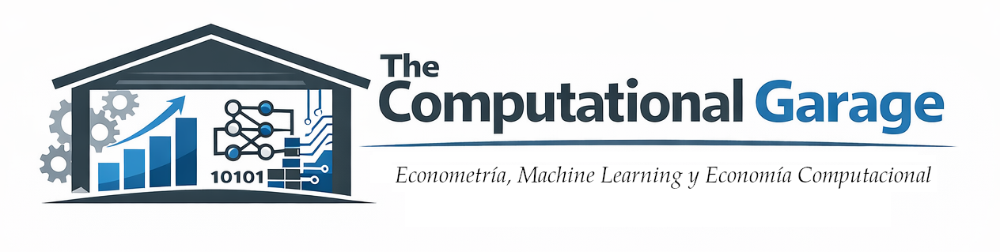

#+TITLE: The Computational Garage - EMLEC UCM
# +SUBTITLE: Econometría en el Espacio de los Estados y Machine Learning
#+AUTHOR: Econometría, Machine Learning y Economía Computacional
# Grupo de Investigación UCM
#+LANGUAGE: es
# +OPTIONS: toc:nil 
#+OPTIONS: title:nil

# Metadatos SEO para Google y otros buscadores
#+HTML_HEAD: <meta name="description" content="The Computational Garage: espacio del grupo EMLEC (UCM) para el intercambio académico entre jóvenes investigadores en econometría y machine learning.">
#+HTML_HEAD: <meta name="keywords" content="Computational Garage, UCM, Universidad Complutense, Universidad Complutense de Madrid, Econometría, Machine Learning, Economía Computacional, Espacio de los Estados, series temporales, jóvenes investigadores">
#+HTML_HEAD: <meta name="author" content="Grupo de Investigación UCM - Econometría, Machine Learning y Economía Computacional">
#+HTML_HEAD: <meta property="og:title" content="The Computational Garage - EMLEC UCM">
#+HTML_HEAD: <meta property="og:description" content="The Computational Garage: espacio del grupo EMLEC (UCM) para el intercambio académico entre jóvenes investigadores en econometría y machine learning.">
#+HTML_HEAD: <meta property="og:type" content="website">
#+HTML_HEAD: <meta property="og:url" content="https://emlec-ucm.github.io/TheComputationalGarage.html">
#+HTML_HEAD: <meta property="og:image" content="https://emlec-ucm.github.io/TheComputationalGarage/TCG-EMLEC-Alargado.png">
#+HTML_HEAD: <meta name="twitter:card" content="summary_large_image">
#+HTML_HEAD: <meta name="geo.region" content="ES-MD">
#+HTML_HEAD: <meta name="geo.placename" content="Madrid, España">
#+HTML_HEAD: 

# ###########
# ESTO DA EL FORMATO FINAL DE LA PÁGINA WEB VÉASE [[https://olmon.gitlab.io/org-themes/]]
# +SETUPFILE: ../css/simple_inlineUCM.theme  
# +SETUPFILE: ../css/bigblow_inline.theme
#+SETUPFILE: ../css/readtheorg_inline.theme
# ###########

# +latex: \maketitle

#+BEGIN_EXPORT html
<h1 class="sr-only">The Computational Garage - Econometría, Machine Learning y Economía Computacional (EMLEC - UCM)</h1>
#+END_EXPORT

# +CAPTION: Título de la imagen
#+attr_html: :width 800px
#+ATTR_HTML: :align center
#+ATTR_LATEX: :width 0.8\textwidth :center t
#+ATTR_ORG: :width 400

#+begin_quote
Esta es una iniciativa del Grupo de Investigación (GI) [[https://emlec-ucm.github.io][/Econometría, Machine Learning y Economía Computacional/ (EMLEC)]] de la Universidad Complutense de Madrid para estimular el intercambio de ideas y la creación de vínculos académicos entre jóvenes investigadores.
#+end_quote

* Sesiones

[[file:TheComputationalGarage/sesiones.org][Calendario e histórico de sesiones]]: próximas sesiones y las ya celebradas, con ponentes, hora y lugar.

* Motivación y propósito

El objetivo de esta iniciativa es crear un espacio informal, recurrente y protegido donde investigadores en etapas iniciales de su carrera académica puedan:

- Presentar y discutir trabajos preliminares (ideas en construcción, proyectos que "aún no funcionan", primeros resultados).

- Conocerse y construir vínculos académicos.

- Compartir problemas, enfoques y métodos en un entorno cercano, sin la presión ni los incentivos propios de un seminario formal.

- Simplemente dar a conocer en qué están trabajando en un foro acogedor y estimulante.

La idea no es organizar un seminario tradicional, sino algo más parecido a lo que uno le cuenta a un compañero de despacho.

* A quién va dirigido

La iniciativa está pensada _para investigadores en etapas iniciales_ (ayudantes doctores, doctorandos en fases tempranas, estudiantes de TFM/TFG), pero sin excluir a investigadores seniors (o no tan jóvenes) que quieran participar.

* Formato de las sesiones

- Duración :: unos 20 minutos de exposición, seguidos de discusión.

- Estilo :: informal, orientado a ideas y problemas, no a resultados cerrados.

- Nivel :: técnico si hace falta; el formalismo es opcional.

- Idioma :: español o inglés, sin preferencia.

- Formato :: flexible.

* Reglas de juego

- En ningún caso se espera que los trabajos estén "listos"; más bien, todo lo contrario.

- Una regla básica para la audiencia será escuchar, comentar con espíritu constructivo y evitar monopolizar la discusión.

* Fechas y calendario

- Periodicidad :: cada dos o tres semanas, /según la demanda/.

- Día de la semana :: martes.

- Horario :: 11:30. /Nunca coincidirá con el seminario del Departamento/ICAE./

- Lugar :: Aula 302, Pabellón de Primero (Facultad de Ciencias Económicas y Empresariales, Campus de Somosaguas).

El calendario se va cerrando de forma flexible, en función de la disponibilidad y del número de participantes. Las fechas concretas están en el [[file:TheComputationalGarage/sesiones.org][calendario de sesiones]].

* Cómo participar

- Para *proponer una sesión* (contar en qué estás trabajando, aunque sea una idea a medio hacer) o para *recibir los avisos* de las próximas sesiones por correo, escribe a [[mailto:thecomputationalgarage@gmail.com][thecomputationalgarage@gmail.com]].

- Para *asistir* no hace falta inscribirse: basta con venir.

