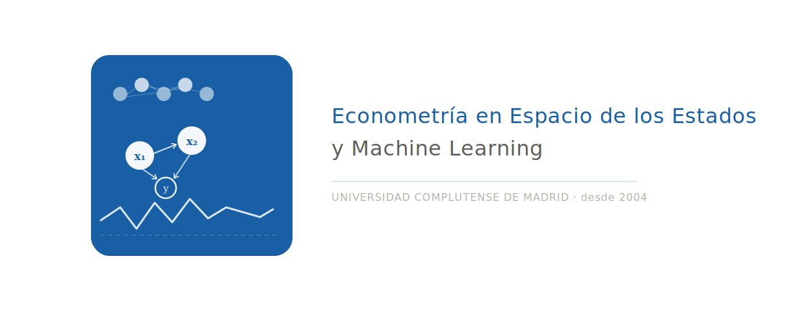
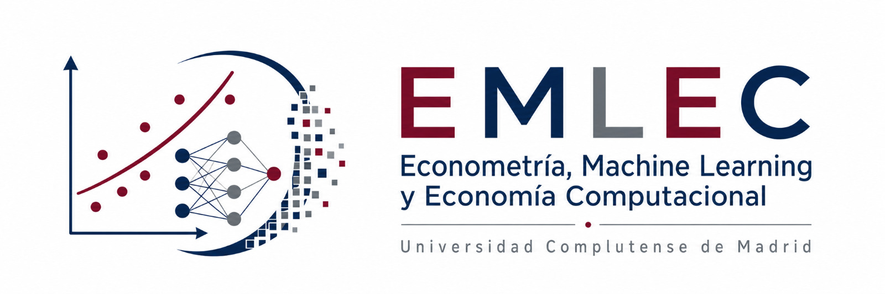

# +title: 940223 - ECONOMETRÍA EN ESPACIO DE LOS ESTADOS Y MACHINE LEARNING
#+title: ECONOMETRÍA, MACHINE LEARNING Y ECONOMÍA COMPUTACIONAL
#+LANGUAGE: es
#+OPTIONS: toc:nil
#+OPTIONS: num:nil
#+OPTIONS: title:nil

# Metadatos SEO para Google y otros buscadores
#+HTML_HEAD: <meta name="description" content="Grupo UCM de Econometría, Machine Learning y Economía Computacional. Investigación en series temporales, modelos factoriales y predicción económica.">
#+HTML_HEAD: <meta name="keywords" content="econometría, machine learning, economía computacional, series temporales, modelos de subespacios, subspace methods, modelos factoriales dinámicos, predicción económica, forecasting, análisis de convergencia de precios, Google Trends, Shapley values, XGBoost, UCM, Universidad Complutense de Madrid, AI trustworthy, green AI, DHR, Dynamic Harmonic Regression, Grupo de Investigación">
#+HTML_HEAD: <meta name="author" content="Grupo de Investigación UCM - Econometría, Machine Learning y Economía Computacional">
#+HTML_HEAD: <meta property="og:title" content="Econometría, Machine Learning y Economía Computacional - UCM">
#+HTML_HEAD: <meta property="og:description" content="Grupo de investigación de la Universidad Complutense de Madrid fundado en 2004. Investigación en series temporales, modelos factoriales dinámicos, predicción económica y machine learning.">
#+HTML_HEAD: <meta property="og:type" content="website">
#+HTML_HEAD: <meta property="og:url" content="https://emlec-ucm.github.io/index.html">
#+HTML_HEAD: <meta property="og:image" content="https://emlec-ucm.github.io/content/emlec-alargado-luna.jpeg">
#+HTML_HEAD: <meta name="twitter:card" content="summary_large_image">
#+HTML_HEAD: <meta name="geo.region" content="ES-MD">
#+HTML_HEAD: <meta name="geo.placename" content="Madrid, España">

# ###########
# ESTO DA EL FORMATO FINAL DE LA PÁGINA WEB VÉASE [[https://olmon.gitlab.io/org-themes/]]
#+SETUPFILE: ../css/simple_inlineUCM.theme  
# ###########

# +attr_html: :style "float: right; width: 20px; margin-left: 1em;"
# +attr_html: :width 250px :align right
# https://www.ucm.es/data/cont/docs/3-2016-07-21-Marca%20UCM%20logo%20negro.png

# # +CAPTION: Título de la imagen
# #+attr_html: :width 900px
# #+ATTR_HTML: :align center
# #+ATTR_LATEX: :width 0.6\textwidth :center t
# #+ATTR_ORG: :width 600
# 
# +CAPTION: Título de la imagen
#+attr_html: :width 700px
#+ATTR_HTML: :align center
#+ATTR_LATEX: :width 0.6\textwidth :center t
#+ATTR_ORG: :width 600

El grupo de investigación [[https://www.ucm.es/grupos/grupo/225][/Econometría, Machine Learning y Economía Computacional/ (EMLEC)]] fue fundado en diciembre de 2004 con el objetivo de organizar nuestras investigaciones sobre la teoría y aplicaciones de los métodos en el Espacio de Estados, enfocándonos especialmente a la modelización econométrica de series temporales. 
Con el tiempo, hemos ampliado nuestro ámbito de estudio al campo del /Machine Learning/.
 
- [[https://produccioncientifica.ucm.es/grupos/5080/detalle][Detalle del grupo]]
- [[https://produccioncientifica.ucm.es/grupos/5080/lineas][Líneas de investigación]]
- [[https://produccioncientifica.ucm.es/grupos/5080/proyectos][Proyectos de investigación]]
- [[https://produccioncientifica.ucm.es/grupos/5080/publicaciones][Publicaciones]]
- [[https://produccioncientifica.ucm.es/grupos/5080/colaboracion][Colaboración]]
- [[https://produccioncientifica.ucm.es/grupos/5080/tesis][Tesis]]

** COMMENT Contacto
Facultad de Ciencias Económicas de la UCM. Campus de Somosaguas. 28223 Pozuelo de Alarcón (MADRID).

** Repositorio del grupo

[[https://github.com/emlec-ucm]]

Algunos de los proyectos desarrollados en este grupo han sido implementados en la [[file:E4.org][toolbox */E4/*]] de MatLab.

* The Computational Garage

#+attr_html: :width 350px
#+ATTR_HTML: :align center
#+ATTR_ORG: :width 400
[[file:TheComputationalGarage.org][file:TheComputationalGarage/TCG-EMLEC-Alargado.png]]

Desde este grupo estimulamos el intercambio de ideas y la creación de vínculos académicos entre jóvenes investigadores.
Más información [[file:TheComputationalGarage.org][*aquí*]]

*  Contacto

Nuestro grupo tiene su sede en la Facultad de Ciencias Económicas de la UCM.
Campus de Somosaguas. 28223 Pozuelo de Alarcón (MADRID).

La persona de contacto es Alfredo García-Hiernaux. Puede enviarle un e-mail pulsando [[https://www.ucm.es/grupoee/formulario][aquí]].

* 

Enlace a la [[https://www.ucm.es/grupoee/][antigua web del grupo]].
